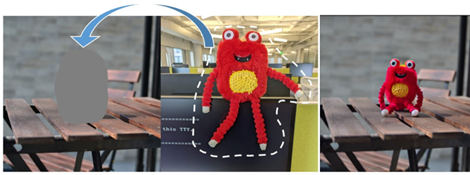
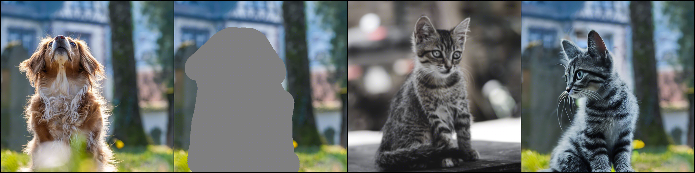
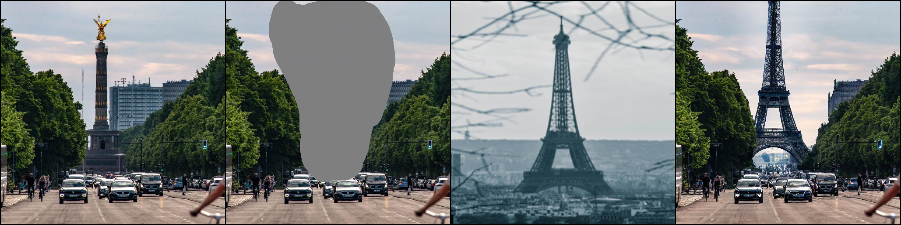

# Subject Inpainting 


<!-- <br> -->
[Beomjo Kim](https://orcid.org/0000-0003-4110-1986), [Kyung-Ah Sohn](https://sites.google.com/site/kasohn/group)

## Abstract
>This paper introduces a novel approach to subject-driven image generation, advancing the field by overcoming the limitations of traditional text-to-image diffusion models. Our method employs a model that generates images from reference images without the need for language-based prompts. By integrating our proposed module named as visual detail preserving module, the model captures intricate visual details and textures of subjects, addressing the common challenge of overfitting associated with a limited number of training samples. We further refine the model's performance through a modified classifier-free guidance technique and feature concatenation, enabling the generation of images where subjects are naturally positioned and harmonized within diverse scene contexts. Quantitative assessments using CLIP and DINO scores, complemented by a user study, demonstrate our model's superiority in overall quality of generated images. Our contributions not only show the potential of leveraging pre-trained models and visual patch embeddings in subject-driven editing but also highlight the balance between diversity and fidelity in image generation tasks.
Keywords: Diffusion Models, Image Generation, Image Inpainting, Subject-Driven Generation, Image Manipulation 
>


## Requirements
A suitable [conda](https://conda.io/) environment named `Paint-by-Example` can be created
and activated with:

```
conda env create -f environment.yaml
conda activate Subject-Inpainting
```

## Pretrained Model
We provide the checkpoint ([Google Drive](https://drive.google.com/file/d/15QzaTWsvZonJcXsNv-ilMRCYaQLhzR_i/view?usp=share_link) | [Hugging Face](https://huggingface.co/Fantasy-Studio/Paint-by-Example/resolve/main/model.ckpt)) that is trained on [Open-Images](https://storage.googleapis.com/openimages/web/index.html) for 40 epochs. By default, we assume that the pretrained model is downloaded and saved to the directory `checkpoints`.

## Testing

To sample from our model, you can use `scripts/inference.py`. For example, 
```
python scripts/inference.py \
--plms --outdir results \
--config configs/v1.yaml \
--ckpt checkpoints/model.ckpt \
--image_path examples/image/example_1.png \
--mask_path examples/mask/example_1.png \
--reference_path examples/reference/example_1.jpg \
--seed 321 \
--scale 5
```
or simply run:
```
sh test.sh
```
Visualization of inputs and output:





## Training

### Data preparing
- Download separate packed files of Open-Images dataset from [CVDF's site](https://github.com/cvdfoundation/open-images-dataset#download-images-with-bounding-boxes-annotations) and unzip them to the directory `dataset/open-images/images`.
- Download bbox annotations of Open-Images dataset from [Open-Images official site](https://storage.googleapis.com/openimages/web/download_v7.html#download-manually) and save them to the directory `dataset/open-images/annotations`.
- Generate bbox annotations of each image in txt format.
    ```
    python scripts/read_bbox.py
    ```

The data structure is like this:
```
dataset
├── open-images
│  ├── annotations
│  │  ├── class-descriptions-boxable.csv
│  │  ├── oidv6-train-annotations-bbox.csv
│  │  ├── test-annotations-bbox.csv
│  │  ├── validation-annotations-bbox.csv
│  ├── images
│  │  ├── train_0
│  │  │  ├── xxx.jpg
│  │  │  ├── ...
│  │  ├── train_1
│  │  ├── ...
│  │  ├── validation
│  │  ├── test
│  ├── bbox
│  │  ├── train_0
│  │  │  ├── xxx.txt
│  │  │  ├── ...
│  │  ├── train_1
│  │  ├── ...
│  │  ├── validation
│  │  ├── test
```

### Download the pretrained model of Stable Diffusion
We utilize the pretrained Stable Diffusion v1-4 as initialization, please download the pretrained models from [Hugging Face](https://huggingface.co/CompVis/stable-diffusion-v-1-4-original) and save the model to directory `pretrained_models`. Then run the following script to add zero-initialized weights for 5 additional input channels of the UNet (4 for the encoded masked-image and 1 for the mask itself).
```
python scripts/modify_checkpoints.py
```

### Training Paint by Example
To train a new model on Open-Images, you can use `main.py`. For example,
```
python -u main.py \
--logdir models/Paint-by-Example \
--pretrained_model pretrained_models/sd-v1-4-modified-9channel.ckpt \
--base configs/v1.yaml \
--scale_lr False
```
or simply run:
```
sh train.sh
```

## Test Benchmark
We build a test benchmark for quantitative analysis. Specifically, we manually select 3500 source images from MSCOCO validation set, each image contains only one bounding box. Then we manually retrieve a reference image patch from MSCOCO training set. The reference image usually shares a similar semantic with mask region to ensure the combination is reasonable. We named it as COCO Exemplar-based image Editing benchmark, abbreviated as COCOEE. This test benchmark can be downloaded from [Google Drive](https://drive.google.com/file/d/18wO_wSFF-GPNxWmO1bt6LdjubXcttqtO/view?usp=share_link).

## Quantitative Results
By default, we assume that the COCOEE is downloaded and saved to the directory `test_bench`. To generate the results of test bench, you can use `scripts/inference_test_bench.py`. For example, 
```
python scripts/inference_test_bench.py \
--plms \
--outdir results/test_bench \
--config configs/v1.yaml \
--ckpt checkpoints/model.ckpt \
--scale 5
```
or simply run:
```
bash inference_test_bench.sh
```
### FID Score
By default, we assume that the test set of COCO2017 is downloaded and saved to the directory `dataset`.
The data structure is like this:
```
dataset
├── coco
│  ├── test2017
│  │  ├── xxx.jpg
│  │  ├── xxx.jpg
│  │  ├── ...
│  │  ├── xxx.jpg
```
Then convert the images into square images with 512 solution.
  ```
  python scripts/create_square_gt_for_fid.py
  ```
To calculate FID score, simply run:
```
python eval_tool/fid/fid_score.py --device cuda \
test_bench/test_set_GT \
results/test_bench/results
```
### QS Score
Please download the model weights for QS score from [Google Drive](https://drive.google.com/file/d/1Ce2cSQ8UttxcEk03cjfJgaBwdhSPyuHI/view?usp=share_link) and save the model to directory `eval_tool/gmm`.
To calculate QS score, simply run:
```
python eval_tool/gmm/gmm_score_coco.py results/test_bench/results \
--gmm_path eval_tool/gmm/coco2017_gmm_k20 \
--gpu 1
```

### CLIP Score
To calculate CLIP score, simply run:
```
python eval_tool/clip_score/region_clip_score.py \
--result_dir results/test_bench/results
```


## Citing Paint by Example

```
@article{yang2022paint,
  title={Paint by Example: Exemplar-based Image Editing with Diffusion Models},
  author={Binxin Yang and Shuyang Gu and Bo Zhang and Ting Zhang and Xuejin Chen and Xiaoyan Sun and Dong Chen and Fang Wen},
  journal={arXiv preprint arXiv:2211.13227},
  year={2022}
}
```

## Acknowledgements

This code borrows heavily from [Stable Diffusion](https://github.com/CompVis/stable-diffusion). We also thank the contributors of [OpenAI's ADM codebase](https://github.com/openai/guided-diffusion) and [https://github.com/lucidrains/denoising-diffusion-pytorch](https://github.com/lucidrains/denoising-diffusion-pytorch).

## Maintenance

Please open a GitHub issue for any help. If you have any questions regarding the technical details, feel free to contact us.

## License
The codes and the pretrained model in this repository are under the CreativeML OpenRAIL M license as specified by the LICENSE file.

The test benchmark, COCOEE, belongs to the COCO Consortium and are licensed under a Creative Commons Attribution 4.0 License.
