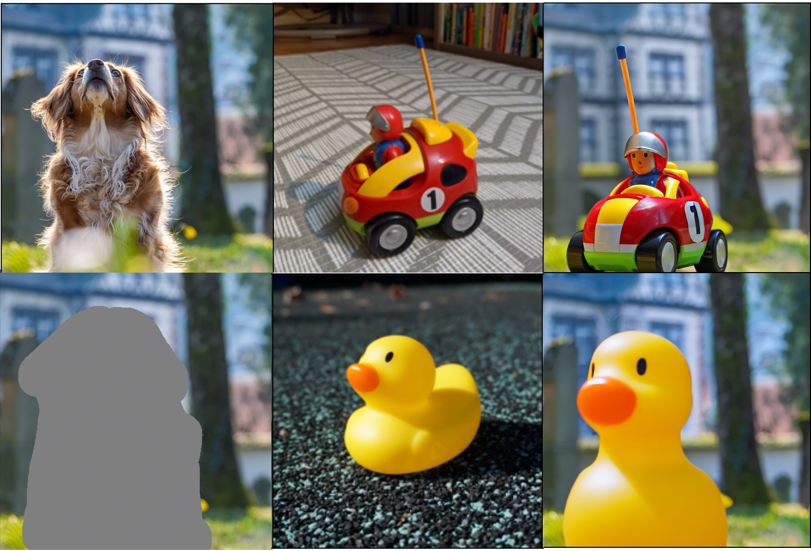
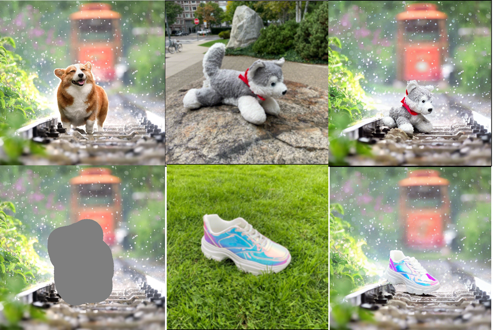

# Subject Inpainting 


<!-- <br> -->
[Beomjo Kim](https://orcid.org/0000-0003-4110-1986), [Kyung-Ah Sohn](https://sites.google.com/site/kasohn/group)

## Abstract
>This paper introduces a novel approach to subject-driven image generation, advancing the field by overcoming the limitations of traditional text-to-image diffusion models. Our method employs a model that generates images from reference images without the need for language-based prompts. By integrating our proposed module named as visual detail preserving module, the model captures intricate visual details and textures of subjects, addressing the common challenge of overfitting associated with a limited number of training samples. We further refine the model's performance through a modified classifier-free guidance technique and feature concatenation, enabling the generation of images where subjects are naturally positioned and harmonized within diverse scene contexts. Quantitative assessments using CLIP and DINO scores, complemented by a user study, demonstrate our model's superiority in overall quality of generated images. Our contributions not only show the potential of leveraging pre-trained models and visual patch embeddings in subject-driven editing but also highlight the balance between diversity and fidelity in image generation tasks.
Keywords: Diffusion Models, Image Generation, Image Inpainting, Subject-Driven Generation, Image Manipulation 
>


## Requirements
A suitable [conda](https://conda.io/) environment named `Subject-Inpainting` can be created
and activated with:

```
conda env create -f environment.yaml
conda activate Subject-Inpainting
```

We have another virtual environment for data preprocessing, this is because the existing environment is incompatible with data preprocessing models. 
the data preprocessing environment can be created and activated with:

```
conda env create -f environment.yml
conda activate lsa
```

## Pretrained Model
We provide the checkpoint ([Google Drive](https://drive.google.com/file/d/15QzaTWsvZonJcXsNv-ilMRCYaQLhzR_i/view?usp=share_link) | [Hugging Face](https://huggingface.co/Fantasy-Studio/Paint-by-Example/resolve/main/model.ckpt)) that is trained on [dreambooth](https://storage.googleapis.com/openimages/web/index.html). 

## Testing

To sample from our model, you can use `scripts/inference.py`. For example, 
```
python scripts/inference_origin.py --plms --outdir results --config configs/v1.yaml --ckpt checkpoints/model.ckpt --image_path examples/image/example_6.png --mask_path examples/mask/example_6.png --reference_path ./dataset/wolf/images/00.jpg --seed 321

```


## Training

### Data preparing
- prepare the subject 3-5 images for training data.
- Get bbox annotations of subject images by running following commands
```
python scripts/make_Bbox.py --target_dir [subject image directory] --text_prompt [subject class prompt]

```
- Generate bbox annotations of each image in txt format.
    ```
    python scripts/read_bbox.py
    ```

The data structure is like this:
```
dataset
subject-images
│  ├── images
│  ├── bbox
```

### Download the pretrained model of Stable Diffusion
We utilize the pretrained Paint-by-Example as initialization, please download the pretrained checkpoints from [PbE pretrained Checkpoints](https://drive.google.com/file/d/15QzaTWsvZonJcXsNv-ilMRCYaQLhzR_i/view?usp=share_link) and save the model to directory `pretrained_models`.

### Training Model 
To train a new model on Open-Images, you can use `main.py`. For example,
```
python -u main.py \
--logdir models/Subject-Inpainting \
--pretrained_model checkpoints/model.ckpt \
--base configs/v1_subject.yaml \
--scale_lr False
```

## Result

This is qualitative results of our model. The first column is input images of our model which is source image (first row) and masked image (second row) 
The second column is reference images
The third column is results of our model






## Acknowledgements

This code borrows heavily from [Stable Diffusion](https://github.com/CompVis/stable-diffusion) and [Paint-by-Example](https://github.com/Fantasy-Studio/Paint-by-Example). For the bounding box annotator code, we used [lang-segment-anything](https://github.com/luca-medeiros/lang-segment-anything/blob/main/environment.yml).

## Maintenance

Please open a GitHub issue for any help. If you have any questions regarding the technical details, feel free to contact us.

## License
The codes and the pretrained model in this repository are under the CreativeML OpenRAIL M license as specified by the LICENSE file.

The test benchmark, COCOEE, belongs to the COCO Consortium and are licensed under a Creative Commons Attribution 4.0 License.
